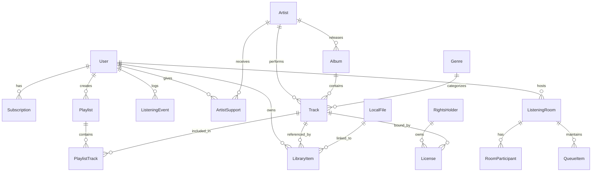

# Core Data Model Specifications (SRS §11)

The platform models 21 core entities to support streaming, local music imports, privacy-preserving personalization, social listening, and user-centric artist payouts.

## 1. Entity Schema Summary

### User & Authentication
- `User`: `id` (UUID), `apple_sub` (string, optional), `email`, `display_name`, `tier` (`free`, `premium`, `audiophile`), `created_at`, `preferences_updated_at`.
- `Subscription`: `id`, `user_id`, `tier`, `currency`, `monthly_amount`, `status`, `current_period_start`, `current_period_end`.
- `Payment`: `id`, `user_id`, `amount`, `currency`, `status`, `payment_processor`, `transaction_timestamp`.

### Music Catalog
- `Artist`: `id`, `name`, `bio`, `avatar_url`, `header_url`, `monthly_listeners`, `verified`, `support_enabled`.
- `Album`: `id`, `artist_id`, `title`, `release_date`, `cover_art_url`, `album_type` (`album`, `ep`, `single`), `genre_id`, `is_lossless`, `max_bit_depth`, `max_sample_rate`.
- `Track`: `id`, `album_id`, `artist_id`, `title`, `duration_seconds`, `track_number`, `isrc`, `genre_id`, `bpm`, `musical_key`, `energy`, `valence`, `acousticness`, `stream_url`, `audio_format` (`aac_256`, `flac_lossless`, `alac_hi_res`), `sample_rate`, `bit_depth`.
- `Genre`: `id`, `name`, `slug`, `color_hex`.
- `RightsHolder`: `id`, `name`, `tax_id`, `country_code`, `payout_account_id`.
- `License`: `id`, `track_id`, `rights_holder_id`, `territories`, `start_date`, `end_date`, `payout_rate`.

### User Library & Personalization
- `LibraryItem`: `id`, `user_id`, `track_id`, `source` (`streaming`, `local_matched`, `local_unmatched`), `local_file_id`, `date_added`, `user_rating`, `is_favorite`.
- `LocalFile`: `id`, `user_id`, `file_name`, `file_size_bytes`, `sha256_hash`, `file_format`, `sample_rate`, `bit_depth`, `local_uri`, `extracted_metadata` (JSON).
- `Playlist`: `id`, `user_id`, `title`, `description`, `cover_art_url`, `is_public`, `created_at`, `updated_at`.
- `PlaylistTrack`: `id`, `playlist_id`, `track_id`, `position`, `date_added`.
- `ListeningEvent`: `id`, `user_id`, `track_id`, `duration_listened_seconds`, `completed`, `skipped`, `playback_source`, `timestamp`.
- `PlaybackSession`: `id`, `user_id`, `device_model`, `audio_output_route`, `actual_bit_depth`, `actual_sample_rate`, `started_at`, `ended_at`.
- `Recommendation`: `id`, `user_id`, `track_id`, `variance_setting`, `score`, `explanation_tag`, `served_at`, `interacted`.
- `Download`: `id`, `user_id`, `track_id`, `local_file_path`, `format`, `file_size_bytes`, `downloaded_at`, `last_accessed_at`, `status`.

### Social & Artist Economy
- `ListeningRoom`: `id`, `host_user_id`, `title`, `current_track_id`, `playback_position_ms`, `is_playing`, `permission_mode` (`host_only`, `moderators`, `everyone`), `created_at`.
- `RoomParticipant`: `id`, `room_id`, `user_id`, `role` (`host`, `moderator`, `listener`), `joined_at`.
- `QueueItem`: `id`, `room_id` / `user_id`, `track_id`, `added_by_user_id`, `upvotes`, `position`, `status`.
- `ArtistSupport`: `id`, `user_id`, `artist_id`, `support_type` (`tip`, `monthly_membership`, `merch`), `amount`, `currency`, `timestamp`.

---

## 2. Core Entity Relationship Diagram

